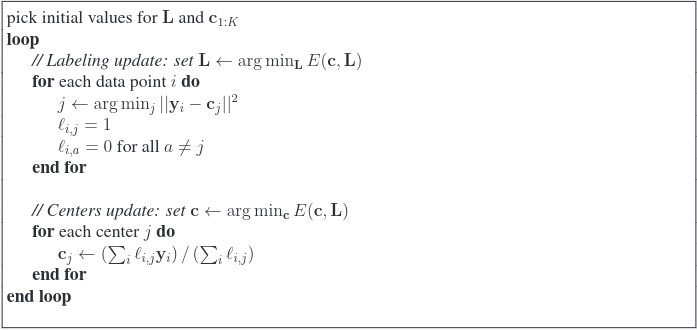
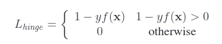
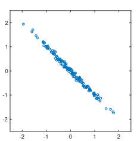

# Topic 1 - What is Machine Learning?
### Introduction
Machine learning is the practice of training the computer to recognize
patterns within some dataset. This results in a complex area of study, where skills
from Computer Science, Statistics and Mathematics are combined to build
**Machine learning model**, that has various degrees of predictive power.

In its core, machine learning relies on **optimization**. Typically, some objective
function is either minimized, or maximized, depending on the problem.

Where traditional programming fundamentally relies on **loops** and **conditionals**,
machine learning approaches relies on **models**, which act as a black box.
A key component of machine learning is how to build these models.

### Machine learning method
Machine learning methods are typically broken into two phases:
- **Training**: A model is learned from a collection of **training data** 
- **Application**: The application of the model to new **test data**

Training process is broadly separated in two groups:
- **Supervised learning**: Where training data is **labelled** with correct answers, and 
the primary goal is to correctly assign future data to the correct label
- **Unsupervised learning**: Where training data is **unlabelled**, and the goal is 
to analyze and discover patterns within the data.

# Topic 2 - Optimization
### Minimization 
In machine learning, we often want to **minimize** some objective function.

A **global minimizer** is simply the global minimum of the objective function.
Similarly, a local minimizer is a local minimum of the objective function. Many 
times, we want to ensure that our objective function is a **quadratic**, hence
guaranteeing that global minimizer is equal to local minimizer.

### First-order Necessary Condition
The FONC just says that if $x^*$ is a local minimizer of $f$ and is a valid point
within its domain, then $\nabla f(x^*) = 0$. 

If we can apply the FONC and solve the minimizer directly, then we say that the 
optimization problem can be solved in a **closed-form solution**.

However, many ML problems cannot be solved in closed-form, and we would need to 
rely on **approximations** and **iterative approaches**.

# Topic 3 - Linear Regression
### Introduction
Linear Regression is the "Hello World" of ML, mainly because it's one of the 
simplest models to understand and to implement.

The reason why it is so "simple" is because it is simply a **line of best fit** 
in some N-D data space. And this results in an important property of LR.

One of the most important properties of LR is that it can be solved in **closed-form**,
which is a characteristic often not seen in more advanced models.

### The Math Behind Linear Regression
Possibly the simplest case of LR is the 1-D case.   
Consider the straight curve
$$
y = wx + b
$$
Our goal is to find the best fitting line by finding the **parameters** of the 
model. Which in this case is simply one weight  $w$  and one bias  $b$.

The way to approach this is to consider the error between  $y_{actual}$ and 
 $y_{estimated}$, which is simply 
$$e_i = y_i - (wx_i + b)$$
where  
$$ y_{actual} = y_i
\\
y_{estimated}=(wx_i +b).
$$

Remember how we wanted our objective function to be a quadratic?
This is where we use that concept to instead minimize  $e_i^2$, which leads to 
a global minimum whenever we obtain a minimum. Using FONC, we can solve for 
 $w^*$ and $b^*$ using the objective function

$$ 
E(w,b)=\sum^N_{i=1} e_i^2
$$

That's actually all there is to linear regression. Except the math gets very 
complicated when we add higher dimensions into the picture, since each point is 
represented as a N-D vector. Understanding the math behind N-D linear regression 
requires you to be well-versed in linear algebra.

Just to give you a glimpse of N-D linear regression, and to show you that 
 $y=wx+b$ is really all there is to LR, here is the formula for N-D LR with 1-D 
output.
$$
E(w)=||y-Xw||^2
$$

# Topic 4 - Non-linear Regression
### Introduction
>A line isn't very "expressive".

While linear regression may work for data that's linear in nature, what happens 
when we have some data that's not linear? Perhaps we have quadratic data, or 
we have data that's distributed normally?

Non-linear regression solves this problem by fitting some non-linear function 
over the dataset, but at the end of the day, we're still trying to minimize 
 $e_i^2$, albeit our  $e_i$ term may look a lot more complicated, and our 
objective function may not even be solvable in closed-form.

### Some Math Behind Non-linear Regression
Ultimately, we are dealing with  $e_i$, so let's generalize Linear Regression to 
include non-linear functions.
$$
y = f(x)
$$
is our general form, where in LR,  $f(x)=wx+b$.

Now, we want to generalize  $f(x)$ to be anything.

#### Basis Function Regression
A common choice of  $f(x)$ is a basis function representation.
$$
y = f(x) = \sum_k w_kb_k(x)
$$
Where  the functions $b_k(x)$ are called basis functions.
##### Polynomial Regression
Polynomial regression uses basis
$$
b = [1, x, x^2, ...]
$$
so that 
$$
f(x) = \sum w_k x^k
$$
##### Radial Basis Function Regression
RBF Regression uses the basis functions 
$$
b_k(x)=exp\left(-\frac{(x-c_k)^2}{2\sigma^2}\right)
$$
and 
$$
f(x) = \sum w_k  exp\left(-\frac{(x-c_k)^2}{2\sigma^2}\right)
$$

Now, we have the objective function as 
$$
E(w) = ||y-Bw||^2
$$
>Note, we are only operating in 1-D input space!

##### A note about parameters
In Machine learning, **parameters** are the variables we want to determine through 
training. For example, in linear and polynomial regression, our goal is to 
determine which weights give us the line of best fit. Thus, our parameters are the 
weights.

On the other hand, **hyper-parameters** are parameters we assign to the model before 
we begin training. These variables aren't what we want to train, but rather, 
**tuning** these variables can help us achieve better results. In other words, 
having better hyper-parameters can help us train better parameters for our model.
For example, the $\sigma$ and $c_k$ in RBF regression are hyper-parameters. These 
hyper-parameters essentially tells the model where to place the normal functions.
Ideally, we want to place normal functions where they could potentially fit the 
data very well.

### Over-fitting and Regularization
A common misconception in regression is that in order to have the best model, 
we must fit the data perfectly during training. This is actually detrimental to 
the predictive power of our model for several reasons.

1. Our training data is simply some sample data. It may not **fully** capture the 
patterns of whatever domain we are trying to model, so trying to fit this data 
perfectly is like trying to decorate an unfinished house. You may decorate it 
brilliantly, but once the house is finished, the decorations will seem out of place!
2. Our training data may have **noise**, or outlier data that doesn't exactly 
follow the trend of the data. Why would we spend so much effort fitting to these noise?

For this reason, it is important to balance the model between **over-fitting** 
and **under-fitting**.

**Over-fitting** occurs when we are fitting the training data perfectly, but fail to 
capture the general trend of the data. For example, we can fit a model perfectly to 
10 data points with 10 parameters, but what good will that do when the data is 
linear in nature? We can simply just use a single parameter to capture the linear 
nature of the data!

**Under-fitting** occurs when our model is too "simple" for the data we are trying 
to model. For example, we can try our best to fit a line over some data that 
follows a parabola, but it likely won't have much predictive power!

#### Smoothness Assumption
> In machine learning, we often have to make assumptions about our data to 
simplify the problem.

An important assumption we can make about our data is that it is likely to be 
**smooth** (ex. small derivatives).

> In other words, if our data is appears linear, the trend is probably not some 
crazy high order polynomial that just appears linear. It is probably just what it 
seems, linear! 

This is a pretty reasonable assumption to make. And it is a pretty good one!
Because we can use this assumption to balance the model between being too "simple",
and being too "complicated".

#### Regularization
The smoothness assumption allows us to balance the model by introducing a 
**regularization term** that penalizes non-smooth functions.
$$
E(w) = ||y-Bw||^2 + \lambda||w||^2
$$
The first term is the **data term**, which is our $e_i^2$, and the second term 
is the **smoothness term**, which penalizes large weights (non-smoothness).

> Note that the **smoothness** we are talking about is not the absence of 
"jagged" corners, but the smallness of the derivative of the function.

Now, any rapid changes in $f(x)$ or non-smoothness is penalized, since we are 
trying to minimize $E$.

What's that $\lambda$ term? Well, it is a **hyper-parameter** that tells the model 
how much emphasis we want on smoothness.
- When $\lambda$ is very low, even if the weights are high, it won't have much 
of an impact on $E$, so we don't really care about high weights.
- When the $\lambda$ is very high, we would want the weights to be as small as 
possible, because even a small decrease in weights would result in a huge 
decrease for $E$.

#### Bias Variance Trade-off
Remember when we talked about **over-fitting** and **under-fitting**? Let's speak 
in terms of statistics.
- Over-fitting happens when the model has high **variance** 
- Under-fitting happens when the model has high **bias** 

What exactly is variance? Think about it in terms of the model having lots of 
expressiveness, lots of fluctuations, lots of "variations". 

And bias? Think about it in terms of the model having some particular favourism,
eg. The model is "biased" towards a certain result. This means that our model is 
not very expressive and doesn't have lots of fluctuations.

Our goal is to have low variance and low bias. So no over-fitting and no 
under-fitting.

### k-Nearest Neighbours Regression
KNN, or k-Nearest Neighbours is a concept that comes up quite frequently in 
simple ML models.

The whole idea behind KNN is that if some $x$ tells us a fact $y$, then 
$x-\epsilon$ probably tells us $y$ as well, for some small $\epsilon$. So basically,
birds of the same kind flocks together.

Using this in regression, all we have to do to predict $y'$ for some $x'$ is to 
ask "which $x$'s in my dataset is closest to this $x'$?". Then I take the average
of these $x$'s.

But how many $x$'s do we take? That's what $k$ tells us.
$$
y=\frac{1}{k}\sum_{i\in N_k(x)}y_i
$$

Note that we can also take the weights into consideration for a weighted K-NN. Now, 
we will treat closer points with a higher importance.

> KNN is really quite simple, but like many things in ML, it's about tradeoff...

Doing KNN means we have to keep around lots of data, compared to when we have a 
standard regression model, where we'd only need to keep its parameters.

### What's Regression then?
Regression is just a way of relating some input data, to some output data. For 
example, we may find some relationship between blood pressure and age + height.

# Topic 5 - Clustering
When we talked about regression, we were in fact talking about **Supervised Learning** 
algorithms. Clustering is a bit different.

**Clustering** is an **Unsupervised Learning** algorithm. In contrast to supervised 
learning, where the goal is to train a model that can predict some output, given
some input(s), clustering is really about grouping the input data according to their
"similarities". In Euclidean terms, this really means grouping the input data 
according to their distances. Closer points in an Euclidean space tend to get 
grouped together.

### K-Means
We start our discussion of clustering by introducing another "hello world" concept 
called "K-Means Clustering". 
The word K-Means really just describes the clustering algorithm.

Let's start with what K-Means does, then we can get into the nitty-gritty of the 
K-Means algorithm.

#### K-Means explained
Suppose we have a bunch of data points and we wish to assign them into groups. How 
would we do that?

Ideally, we don't want to assign the points into random groups, because that achieves
nothing. How about assigning the points into groups based on how similar they are to 
each other? Let's represent this similarity in Euclidean terms. In other words, 
points $x$ and $y$ are similar if they're close to each other. Then, we want to 
assign these similar points into **clusters**.

> **Clusters** contain points that are "similar" to each other.

Now, we have a bunch of clusters. Suppose we are given a new point, which cluster 
does this point belong to? We need some way to represent the cluster. How about a 
centroid? In other words, the mean of all the points inside the cluster. Now, if we 
have a new point, we can just compute the distance to each centroid, and assign the 
point to the cluster with the nearest centroid to that point.

But we're getting ahead of ourselves. How do we determine the centroids? And how do we 
determine the assignment of each point into a cluster? This is what K-Means 
does.

#### K-Means algorithm
Let's get into the math.

Let's represent the assignment of point $y_i$ to a cluster $j$ with a matrix $L$, so that 
$$
l_{i,j} = \begin{cases}
  1  & \text{if data point $i$ belongs to cluster $j$} \\
  0 & \text{otherwise}
\end{cases}
$$

In addition, let's represent the centroid of cluster $j$ with $c_j$.

Then, our objective, or goal, is to find the assignment of points to clusters, 
represented by $L$, that gives us the minimum error, which in this case, is the sum of
distance between each point in the cluster and their centroid, for each cluster.

> We're minimizing error again... In fact, we are minimizing error quite frequently 
in ML.

The objective function of K-Means is defined as: 
$$
E(\{c_j\}_{j=1..K}, L) = \sum_{i,j}l_{i,j}||y_i-c_j||^2
$$

Where $l_{i,j}$ makes sure that we are accounting for the distance only if point 
$i$ is assigned to cluster $j$.

Minimizing this objective function is hard and its closed-form cannot be solved for. 
In fact, it is a **NP-hard** problem. Thus, we turn to an **approximation technique** 
called **block coordinate descent**, where we alternate between holding one set of 
variable constant, and performing closed-form optimization on another set of 
variables. The condition is of course that we are able to perform closed-form 
optimization on each set of variables.

Here is the K-Means algorithm.
  

In the **labeling update**, we are trying to assign each data point to the 
closest centroid.

In the **centers update**, we are trying to obtain a new center based on the updated 
assignments in the previous step.

This algorithm is guaranteed to converge, and to test for convergence, we simply 
detect whether two iterations give the same $L$, in which case, $L$ will never change 
again, and we have converged.

#### Initialization of K-Means
A problem with K-Means is that depending on the initialization, we may not find the 
global minimum. Thus, we need to consider our initialization more carefully.

Some initialization methods include 
- Randomly assign all the points into clusters.
- Randomly picking the centers.
- Starting K-Means multiple times with different assignments and choose the best one.
- K-Means++, an algorithm that initializes centers to be relatively far from each 
other.

#### Problems and Optimizations for K-Means
If it is still unclear, $K$ is the number of centers (or the number of clusters).

A problem with K-Means is that one has to store and search all $K$ centers in order 
to assign new data points. This may lead to performance issues if the training dataset 
is large enough.

One way to improve search-time is via **hierarchical K-Means**. The key idea of 
hierarchical K-Means is to use a small number of clusters initially, and within 
each of these clusters, perform K-Means again, and so on, until we have K clusters. 
This leads to a tree-like structure that gives logarithmic search time for 
$K clusters$.

One way to improve space complexity is to use **Product Quantization**. The idea is 
to break input vectors into $H$ parts, then perform clustering on each of $H$ parts
into $M$ clusters. Now, we have $M^H$ ways to cluster any input vector by combining
the $H$ parts together in different ways. This gives logarithmic storage for 
$K$ cluster centers.

### Gaussian Mixture Model
GMM is a **generative model** that seeks to assign data points into clusters based 
off of probabilities. This means that a data point $y_i$ can be assigned to 
multiple clusters with varying degrees of probabilities. How is this possible?

While K-Means seeks to assign data points based off of its nearest center, GMM 
tries to model each cluster with its own **normal distribution**. This allows for 
overlaps between different clusters, as their normal distribution overlaps.

> Normal distributions are also called **Gaussian distributions**, hence the name
Gaussian Mixture Model

#### The Mixture of Gaussians
GMM is basically a mixture of normal distributions. Where the GMM is a linear 
combination of $K$ normal distributions, each with its own mean and covariance.
$$
\{(\mu_j,C_j)\}^K_{j=1}
$$
Each normal distribution is also assigned a **mixture weight** $m_j$, representing
the "degree of importance" of that specific normal distribution. 
$$
m_j=P(l=j|\theta)
$$
Note that $\Sigma_jm_j = 1$.

Then, to obtain the GMM, we must find the parameters
$$
\theta=\{m_{1:k},\mu_{1:k},C_{1:k}\}
$$

#### Derivation of the GMM
What we really want is $p(y|\theta,l=j)$, where $l$ represents which of the $K$ 
Gaussian components the data point $y$ is generated by, hence which of the $K$ 
Gaussian components it belongs to. Let start off with the likelihood of a single 
data point given the parameters $\theta$.
$$
\begin{align}
p(y|\theta) &= \sum_{j=1}^K p(y, l=j|\theta) \\
&= \sum_{j=1}^K p(y| l=j,\theta)P(l=j|\theta)
\end{align}
$$
Note that $p(y|l=j,\theta)$ is essentially just $G(y;\mu_j,C_j)$, so we have 
$$
p(y|\theta) = \sum_{j=1}^K m_j G(y;\mu_j,C_j)
$$

#### Finding $\theta$ 
How do we really find $\theta$?

We can do so by maximizing the likelihood of every training data point given the 
parameter $\theta$. The standard way to do this is to minimize the negative 
log-likelihood of the data.
$$
L(\theta) = -\ln p(y_{1:N}|\theta) = - \sum_i p(y_i|\theta)
$$
Unfortunately, the closed-form for this function is unavailable to us, but like 
KNN, we can use an iterative algorithm called **Expectation Maximization** algorithm 
to help us obtain $\theta$.
  
Unlike KNN, our matrix $L$ now contains the probability of data point $i$ belonging
to cluster $j$. The rest is actually quite similar, instead of updating our centers,
we update the mixture weight, the mean, and the covariance of each cluster. Also, 
the algorithm converges when there isn't any change across iterations.

#### GMM vs. K-Means
It's pretty important to observe the similarities between K-Means and GMM. In fact,
K-Means is just a special case of GMM, where 
- The mixture weights are equal: $m_j=\frac{1}{K}$ 
- The Gaussians are spherical with identical variances: $C_j = \sigma^2I, \forall j$ 
- The Gaussian variances approaches 0, this causes the $L$ matrix to contain 
binary values, since there are no variances in the data, and hence if a data point 
is assigned to a cluster, it has probability 1.

### What is Clustering?
Clustering is essentially grouping of the data based off of similarities. This has 
important applications in data pre-processing, where we perform clustering beforehand
to increase the accuracy of say, regression analysis by grouping similar items 
together beforehand. Also, we can perform data compression by representing every point 
in the cluster with its centroid.

# Topic 6 - Classification
Now let's turn our attention one of the most important topic in ML. Classification 
is a difficult task to perform using standard programming constructs, and thus is 
an area of focus in ML models. 

Classification is a **supervised learning** technique that 
seeks to "classify" inputs into different categories. In the case of 
**binary classification**, we are simply interested in whether a given input has 
some property or not. This may sound too simple to be useful, but lots of useful 
problems are just binary classification problems, like detecting whether an email is 
spam or not. On the other hand, **multi-class classification** seeks to classify 
inputs into multiple categories.

> We mainly focus on **binary classification**, because many binary classification 
methods generalize well to multi-class classification.

To classify inputs into categories, we specify a **decision boundary**, so that, 
in the case of binary classification, if the output is above the decision boundary,
then it is one class, and if the output is below the decision boundary, it is another.

### Regression Classification
It is possible to perform classification using linear regression by defining 
outputs $y\in\{-1,1\}$ and performing linear regression. The result is a line that 
"crosses the horizontal axis" at some point, which we can define the decision 
boundary as that point of intersection. This means that we can determine the class 
of a new point by $sgn[w^Tx]$, where 
$$
sgn[z] = \begin{cases}
-1 & z \le 0 \\
1 & z \gt 0
\end{cases}
$$
> In higher dimensions, the decision boundary is a **hyper-plane**.

There is a critical problem with this classification technique.
- Since the objective function for LR seeks to minimize distance between the 
regression plane and the data points, extreme outliers (ex. y = 22, when class 
label is 1) will have large error but is in fact classified correctly. In this case, 
the decision boundary will be "shifted" towards this extreme value in order to 
minimize the error. This is not what we want.

This problem comes from the fact that we are "forcing" the binary labels onto 
outputs that involve magnitude. Since we only care about the sign of the output,
considerable representational power is wasted.

#### Loss Functions in classification by regression
Another way to understand this is through **loss-functions**. To produce the best 
classifier, we want to minimize the loss of information when we're training the model.
This loss of information occurs when we classify points wrongly.

An ideal loss function for classification is the **0-1 loss function**, which is 
simply just assigns a loss of 1 if the point is classified wrongly and 0 otherwise.
The loss over the entire training set is then just the total misclassified points.

In the case of regression classification, our loss function is the objective function 
of the LR model, which is the sum of the squared errors. This is a 
**squared loss function** , which penalizes points even when it's classified correctly.

  
This is why regression classification is far from ideal.

### K-NN Classification
Like K-NN regression, we can similarly perform classification using K-NN concepts.
With output labels being $y\in\{-1,1\}$, we can simply choose $k$ nearest neighbours 
and add their output labels together. Note that we can equally apply weighted 
K-NN in this scenario, by placing more importance on closer points.

Like all K-NN approaches, we must keep around all training data, which can get 
very expensive, not to mention that high dimension distance computations can become
very time-consuming.

If we wish to "smooth out" the decision boundary, we can simply increase, $k$, which 
is effectively telling the model to base its decision off of more points, thus 
decreasing variance and increasing bias.

### Decision Trees
Decisions trees is an effective method in classification that relies on "tests" on 
the input features. We will focus on binary decision trees with real-valued features.

#### What is a Decision Tree?
As its name implies, a decision tree is a tree-like structure with nodes and branches.

An **internal node** represents some binary test on the input features. For example,
one of our input features could be height, and thus our test could be whether 
the height is greater than some value. $t_j(x)$ is a test on node $j$ that returns -1 
and directs $x$ to the left child-node and returns +1 and directs $x$ to the right 
child-node. These tests, then represents the decision boundary of the model.
  
A **leaf node**, on the other hand, represents a conditional probability distribution 
over the class labels, denoted by $P(y=c|j)$. The higher this probability, the 
more likely that a point reaching this node will belong to class $c$.

The parameters of a decision tree includes the tree itself, consisting of tests at 
each internal node, and the probabilities at each of the leaf nodes (which 
represents the certainty that an input is of a class $c$).

#### Learning a decision tree
Learning a decision tree ultimately comes down to determining which tests to use,
and in which order they should be applied. Both is important, because they ultimately 
determine the decision boundary of the model over the training data.

Since learning an optimal decision tree is a NP-hard problem, we often take a 
greedy approach that recursively constructs the decision tree from the root, choosing 
the best split test at each node to be the test for that internal node. Once we 
determine that all or majority of the points on that node is of the same class, we can 
stop recursing on that branch and use that node as a leaf node. This process 
continues until we reach a leaf node for all branches.

These split tests are called **decision stumps**, and to determine the quality of 
each split test, we can measure the **information gained** for each split test on a 
node. We then choose the split test that provides the highest information gained to be 
the best split test for that node.

##### Entropy
Entropy $H$ measures the uncertainty in a random variable, defined by 
$$
H=-\sum_{c=1}^K p_c log_2 (p_c)
$$
> Log of base 2 for binary classification

Note that $H$ is maximum when $p_1=p_2$, or in other words, uncertainty is maximum.
When the node has mostly or all of one class, then uncertainty is very small or zero.

##### Information Gained
We can now define information gained as a **reduction in Entropy** by partitioning
the data according to a specific split test.
$$
IG(D_j,t_j) = H(D_j) - \frac{N_L}{N_j}H(D_L) - \frac{N_R}{N_j}H(D_R)
$$
where weights are assigned to both $H(D_L)$ and $H(D_R)$ to account for unequal 
partition of data.

The goal then is to choose the best split test at each node during the recursive call 
according to the maximum information gained amongst the potential split tests.

#### Run-time considerations
Note that if we have inputs of many dimensions, our decision boundaries may 
become quite expressive. For example, if we choose our split based on two features,
then we must consider all possible combinations of the partition of the two features.
This can become very expensive, and thus we usually consider **univariate splits**,
which is simply just split tests that compare one feature dimension at a time. For 
example, if we have height and weight as features, we may only choose to split 
according to a certain threshold of height, or according to a certain threshold of 
weight, but not both. This guarantees a linear number of tests per node.

### Class Conditionals
Now lets turn our attention to some generative approaches to classification. In 
other words, we are trying to model the probability of $x$ given a certain class 
$c$, rather than modelling the probability of a certain class, given $x$. This 
approach is inherently generative, because we are trying to model some underlying
probability distribution of the data.

Let start by stating the likelihood of a single point assuming there are two classes 
(binary classification).
$$
p(x) = p(x,c_1) + p(x,c_2) = p(x|c_1)P(c_1) + p(x|c_2)P(c_2)
$$
In generative models, we are trying to model $p(x|c_1)$ and $p(x|c_2)$ using 2 
distributions. However, like discriminative models, 
we still need to find $p(c|x)$ to properly classify.

By Bayes' Rule 
$$
P(c_i|x)=\frac{p(x|c_i)P(c_i)}{p(x)}
$$

However, since we only have 2 classes, we can simply consider the ratio,
$$
\frac{P(c_1|x)}{P(c_2|x)} \gt 1?
$$

Which reduces to 
$$
\frac{p(x|c_1)P(c_1)}{p(x|c_2)P(c_2)} \gt 1?
$$

We typically perform the computation in the logarithm domain, so we can reduce the 
above to.
$$
a(x) = \log\left(\frac{p(x|c_1)P(c_1)}{p(x|c_2)P(c_2)}\right) \gt 0?
$$
Where a(x) = 0 is our decision boundary.

#### Gaussian class conditions (GCC)
As a discrete example to class conditions, we can consider 
$$
p(x|c_i)=G(x;\mu_i,\Sigma_i)
$$
Assuming equal prior class probabilities, our decision boundary reduces to:
  

### Naive Bayes
One key problem that class conditionals have is that learning distributions often 
lead to a large number of parameters. In the example of GCC, we need to learn the 
covariance matrix, which is quadratic in the number of features.

One helpful assumption, albeit "naive", is to assume that the features are independent.
This means our covariance matrix is quite literally a vector of variances, which is 
linear in the number of features.

Also, we can reduce $p(x|c)$ to 
$$
p(x|c) = \prod_{i=1}^d p(x_i|c)
$$
Rather than estimate one $d$-dimensional density, we are estimating $d$ 1-dimensional 
densities. This proved helpful in the case GCC.

#### Simplifying Discrete Input Features.
With Discrete features, ex. data vector $x = F_{1:d}=[F_1,...,F_d]$ such that 
$F_i\in\{0,1\}$, the complexity in calculating $P(F_{1:d}|c=j)$ is exponential in 
$d$. This is because there are could be many dependencies amongst the features.

This is precisely why we introduced the assumption of independence between features.
So that the complexity is linear in the $d$ instead. This assumption is naive 
indeed, because often-times features have some dependencies between them, but this 
assumption works surprisingly well a lot of the times.

Let's take a look at the math by expanding out $P(c=j|x=F_{1:d})$.
  
Where $c$ denotes a class $c\in\{1,2,...,K\}$ and 
$$
a_{i,j}=P(F_i=1|c=j)
$$
Of course, actual computations happen in the logarithmic domain, since multiplying 
many small numbers together is never a good idea, but we will omit that here.

#### Learning Discrete Input Features.
Learning the parameters $a_{i,j}$ and $b_j$ is quite simple. Since $b_j$ is just 
$P(c=j)$, we can just take $b_j$ as the portion of examples in class $j$ in the dataset.
$$
b_j=\frac{N_j}{N}
$$
Where $N_j$ is the number of training examples of class $j$ with $N$ examples in total.

And $a_{i,j}$ is just the number of examples with feature equal to 1 in a given class.
$$
a_{i,j}=\frac{N_{i,j}}{N_j}
$$
In order to avoid $\ln(0)$ in actual training within the logarithmic domain, we can 
pad some values to the numerator and denominator. We will not show that here.

### Logistic Regression
Despite the name regression, Logistic Regression really doesn't have much to do with 
regression. It is instead a clever application of algebra, to skip the need to 
calculate $p(x|c)$ in class conditionals, but instead directly calculate $p(c|x)$.
Let's see how that is done.

Against, let's state the likelihood of $x$ 
$$
p(x) = p(x,c_1) + p(x,c_2) = p(x|c_1)P(c_1) + p(x|c_2)P(c_2)
$$
It is straightforward to show that $P(c_1|x)$ can be expressed as
$$
P(c_1|x) = \frac{p(x|c_1)P(c_1)}{p(x|c_1)P(c_1) + p(x|c_2)P(c_2)}
$$
Dividing the numerator and denominator by $p(x|c_1)P(c_1)$, we get 
$$
P(c_1|x) = \frac{1}{1+e^{-a(x)}} = g(a(x))
$$
where $a(x)=\ln\frac{p(x|c_1)P(c_1)}{p(x|c_2)P(c_2)}$, and $g(a)$ is the 
**Sigmoid function**, which has range $y\in\{0,1\}$, giving us exactly 
$P(c_1|x)=\frac{1}{2}$ precisely when $a(x)=0$, which is our decision boundary.

Moreover, we can assume that $p(x|c_1)$ and $p(x|c_2)$ are Gaussian distributions with 
identical covariances, which in fact reduces the above expression to
$$
P(c_1|x)=\frac{1}{1 + e^{-w^Tx-b}} = g(w^Tx+b)
$$
Which provides linearity to $a(x)$, a desirable property.

While our assumptions of Gaussian distributions with identical covariances may not 
exactly hold true, the approximation is nonetheless good enough with a linear 
number of parameters (rather than quadratic number of parameters without the 
assumption about covariances).

#### Training the Logistic Regression Model
We will train the model via maximum likelihood estimation, by minimizing the 
negative log of $p(\{x_i,y_i\}|w)$, which yields the objective function 
$$
L(w) = -\sum_{i=1}^N y_i \log P(c_1|x_i) + (1-y_i)\log(1-P(c_1|x_i))
$$

To minimize $L(w)$ w.r.t $w$ requires solving for the gradient, which simplifies to 
$$
\frac{\partial}{\partial w}L(w) = -\sum_{i=1}^{N}(y_i-p_i)x_i
$$
where $p_i = P(c_1|x_i)$ 

Unfortunately, there is no closed-form solution for $\frac{\partial}{\partial w}L(w)=0$.
Rather, we can perform **gradient descent** to find the absolute minimum of $L(w)$,
due to its convexity.

### Generative vs. Discriminative Models
To finish off our discussion on classification, I want to talk about the differences 
between a generative model and a discriminative model.

The difference is quite simple, discriminative models attempt to model 
$p(c=y|x)$. In other words, discriminative models aim to model the probability 
of being in class $c$, given the input. This can be seen in logistic regression and 
decision trees, where we are given a data point, and the model seeks to directly 
determine which class this data point belongs to.

Generative models on the other hand, requires the model to estimate the 
probability distribution, $p(x|c)$ to calculate the probability that this data point
"came from" class $c$. This is seen in Class Conditionals and Naive Bayes where we 
are seen trying to estimate a class-specific distribution for the data points. In 
addition, generative models also specify a prior $P(c)$, that specifies the weight of 
a certain class. Bayes' rule is then applied to these probabilities for classification tasks.

#### Advantages and Disadvantages
It is apparent that discriminative models skip over the assignment of conditional 
distributions to the data, and as a result, it is often more efficient.

Generative models on the other hand allows us to put more prior knowledge into the 
model and allows us to specialize the model to particular problems. However, this 
added expressiveness also comes with difficulties when it comes to efficiency and 
trying to calculate for $p(c|x)$.

# Cross Validation
Let's take a break from ML models and talk about **cross validation**.

How do we validate whether a model is good or not? We could always try to fit the 
training data as well as possible, and call that our "best" model, but as we've seen 
before, fitting the training data too well could also be bad, since it may not 
generalize well to new data.

Thus, the sure way to evaluate a model is to actually see how well it generalizes to 
new data, by testing the model using a testing set, different from the training set 
and see how well it performs.

**Cross validation** is typically used to determine a model's hyper-parameters, by 
comparing the model's performance across different hyper-parameter values. For example,
we could try to determine the best $K$ in K-NN, or determine the $\sigma$ in RFB.

### Hold-out Validation
The idea of hold-out validation is to reserve some of the training data as 
testing data, then for each reasonable hyper-parameter value, train the model on the 
training set and evaluate the model on the testing set. In the end we will choose 
the hyper-parameter that results in the best generalization.

This is an easy approach, but we must have enough training data to begin with, 
otherwise we cannot really afford to split the data like this.

### $N$-Fold Cross Validation
The idea is to partition the data into $N$ sets of equal size, then run the 
learning algorithm $N$ times, each time using a different set as the testing set 
while using the rest as training set. We then score the model by taking the average 
of the performances across the $N$ runs. We will repeat this process for all 
reasonable values of hyper-parameters. 

Clearly, this method makes better use of the data, since we are using every data 
point in both the training and test process, but it is also quite a bit slower
to execute. Since we are still partitioning the data, we need a relatively large 
size sample.

# Adaptive Boosting
### Ensemble Methods
**Ensemble methods** describe a general class of learning algorithms that 
attempts to build better learning algorithms by combining multiple simpler algorithms.

**Boosting** is a specific type of ensemble method that takes a collection of 
"weak classifiers" (simple models that do slightly better than chance) and averages 
their output, to create a much better classifier. A very popular boosting method 
is **Adaptive boosting**, also knows as **Adaboost**.

### Adaptive Boosting
Suppose we are given N training data $\{(x_i,y_i)\}_{i=1}^N$ where $x_i$ is 
$K$-dimensional and $y_i \in \{-1,1\}$, and we're given some potentially large number 
of weak classifiers $f_m(x)\in\{-1,1\}$ and a 0-1 loss function, defined as 
  
Then the boosting algorithm is as follows 
  
Let's try to understand the algorithm.

Note that at first, we are assigning a weight to each data point, this weight could 
be interpreted as "how much emphasis we are placing on this data point". So initially,
we have no information, and thus they're all 1's.

Then we start the boosting process, by iterating through all the "weak classifiers".
For each classifier, we want to minimize the objective function: 

  
Note that $I=1$ only if $x_i$ is misclassified, so intuitively, this objective function seeks to minimize the number of misclassified points, at least during the first 
iteration. Note that during the first iteration, $\epsilon$ is simply a percentage 
error, since all $w_i$'s are 1.

Then, as the weights change, the classifier will prioritize those data points whose 
$w_i$ is large, trying to classify those correctly, in order to make $I=0$ for those 
data points with large weights. Note that as the iterations go on, $\epsilon$ can be 
seen as "weighted percentage errors".

In summary, $\epsilon_m$ is simply the error for classifier $m$.

Let's move on to the next line,

  
$\alpha_m$ is simply the "voting power" or "accuracy" of classifier $m$, the higher the error 
$\epsilon_m$ for classifier $m$, the less "voting power" it gets, since it is not 
very accurate, and hence it should have less of a say at the end, when we take all 
classifiers into account. On the contrary, if classifier $m$ has low error, then 
we should give it more "voting power", since it is more accurate.

Finally, we assign new weights to each data point to be used for the next 
classifier.
  
The weight assignment process goes like this:
- If the point is classified correctly, $I=0$ and the weight doesn't change. This means that the point is not of a primary concern.
- If the point is misclassified, $I=1$ and we have a scaling factor of 
$\frac{1-\epsilon_m}{\epsilon_m}$ on the weight associated with that point. If 
the error is low for classifier $m$, then it should have more "say" in 
"how misclassified the point is". For instance, if an accurate classifier, ex.
low $\epsilon_m$ says that the point is misclassified, we should give that point 
more weight to be considered for the next round, because an accurate classifier's 
results bear "more weight". 
On the other hand, if a less accurate classifier says a point is 
misclassified, then we might be more cautious, and thus we will assign a lower weight 
to the misclassified point, because the misclassification might not be all that 
reliable.

And that is the entirety of the Adaptive Boosting algorithm. At the end, we take the 
weighted average of all classifiers to determine the class, giving more accurate 
classifiers more weight.

  

### Decision Stumps as "Weak Classifiers"
We've been talking about "weak classifiers", but what are they?

A "weak classifier" should be simple and easy to train and implement. An example of 
a weak classifier is a **decision stump**. A decision stump is simply 
$$
f(x) = s(x_k > c)
$$
Where $x_k$ is the k-th feature of data point $x$, and $c$ is a scalar.

Intuitive, a decision stump is basically an axis-aligned line that separates the 
data points. We can easily use a brute-force algorithm to determine the best 
decision stump by ordering the data points by the k-th feature, placing the 
$c$ in between each ordering, and calculating the error of that placement. We can 
then repeat this for all the features, to give us the best decision stump at that 
iteration.

> Note that Adaptive boost is simply a greedy algorithm that chooses the best 
"weak classifier" at any given iteration, and hoping it will give the best possible 
result.

### Why it works?
Adaptive boosting seems quite simple, why does it work so well? Let's analyze 
Adaboost from a loss function perspective. 

Adaboost can be viewed as a **greedy optimization of exponential loss**.
We will skip out on the details here, but going through the optimization, we end up 
exactly with 
$$
\alpha_m = \ln\frac{1-\epsilon_m}{\epsilon_m}
$$
on condition of 

  
Giving us the steps in the Adaboost algorithm.

# Support Vector Machines (SVM)
Now we turn our attention to one of the most influential classification algorithms 
called **Support Vector Machine**. SVMs are responsible for introducing many 
important ideas in ML, namely **Kernel Methods**, **maximum margin methods**, and 
etc.

### Maximizing the "Margin"
Suppose we are given $N$ training vectors $\{(x_i,y_i)\}$ where $x$ is a 
D-dimensional vector and $y\in\{-1,1\}$ and we want to learn a classifier: 
$$
f(x) = w^T\phi(x) + b
$$
so that the classifier's output is sgn$(f(x))$

Note that our classifier is once again, just a **hyper-plane** separating two 
classes. But what makes SVM different from say Linear Regression? Specifically,
which line would SVM choose?
> Note that SVM requires two classes to be **linearly-separable**, that is, we 
should be able to draw a straight line separating the two classes.

SVM seeks to **maximize the margin**, that is, the distance from the hyperplane to 
to the closest data point in either class. Think of this as driving with the 
"maximum margin for error" by maximizing your distance from either side of the 
road when driving. More precisely, we want to optimize the following objective function.
  
To break this function down, first we consider the minimum distance from the 
hyperplane to some data point $x$. Then we say, can we increase this 
minimum distance as much as possible? Our goal then, is to have the maximum 
minimum distance from the hyperplane to any data point.

Consider 

  
Note we still have some room to increase the distance from the red line to the 
yellow point.
  
Here, we've maximized the margin. Note that all 3 circled points are now the 
points with minimum distance to the line, and we've placed the line in the middle 
of these points, thus maximizing the minimum distance. If we move the line either way,
we'd lose some margin.

Next, let's consider the second part, since SVM requires the data points to be 
linearly-separable into two classes, meaning we can draw some hyperplane that 
separates the two classes, our constraint expresses exactly that.

Since $y\in\{-1,1\}$, then if the point was classified correctly, then 
$y$ and $(w^T\phi(x)+b)$ should be the same sign, and thus $y(w^T\phi(x)+b)$ should 
be positive. On the other hand, if the point was classified incorrectly, 
$y$ and $(w^T\phi(x)+b)$ should have different signs, and thus $y(w^T\phi(x)+b)$ 
should be negative. Note we require $y(w^T\phi(x)+b)$ to be positive for all $x$, 
and thus we require all points to be classified correctly.

### Non-linearly separable Data
You might have noticed that we used $\phi(x)$ instead of $x$. This is to deal with 
linearly-unseparable data. If the data was linearly-separable, then we would have 
$\phi(x)=x$. $\phi$ is just a function that maps data points to a higher dimension,
where it would be linearly-separable. We will introduce slack variables later to 
allow for some inseparability.

### Deriving the Objective Function
Finally, let's start deriving the objective function for SVM.

First, how do we represent the distance from $\phi(x)$ to the hyperplane 
$w^T\phi(x) + b = 0$? This is given by 
$$
\frac{|w^T\phi(x_i)+b|}{||w||}
$$
Projection of the point onto the normal vector of the hyperplane. 

Since we have the 
constraint that $y(w^T\phi(x)+b)$ to be positive for all $x$, we can represent the 
distance using
$$
\frac{y_i(w^T\phi(x_i)+b)}{||w||}
$$
And finally the modified objective function.

  
Since $w$ is just a normal vector, it could technically be of any length. Suppose we 
choose the length of $w$ so that the nearest point to the hyperplane $x_i$, satisfies
$y_i(w^T\phi(x_i)+b)=1$, then we can simplify the objective function to

  
We're not done yet, maximizing $\frac{1}{||w||}$ is equivalent to minimizing 
$\frac{1}{2}||w||^2$, so we get our final objective function.

  
This is a good objective function because it is a **quadratic program**, which means 
the objective function is quadratic in the unknowns and the constraint is 
linear in unknowns. A quadratic program has a single global minimum, which can be 
found efficiently with optimization packages, making it ideal for an 
objective function.

### Support vectors
Let's come back to this image 

  
In a SVM, only a few points will be close to the margin, and thus only a few 
points will play an important role in determining the decision boundary. These 
points (circled) are called **support vectors**. Small movements in other points 
other than the support vectors will have no effect on the decision boundary. 

This is 
the primary difference between SVM and probabilistic models we've seen before, where 
each data point plays some role in determining the location of the decision boundary.

### Slack Variables for Non-Separable Datasets
Since many datasets will not be linearly separable, we need a way to deal with it.
One way is to introduce **slack variables**, which in effect loosen the constraint 
by allowing points to be inside of the margin and even allowing points to 
cross the margin (misclassified). But this effect is indirectly embedded into the 
objective function. Meaning we want to determine the best decision boundary, given 
the loosened constraints, allowing more flexibility in choosing the decision boundary.

We add a slack variable for each data point $\xi_i$ and introduce these slack 
variables to the objective function in a way such that we want to minimize the use 
of them.

  
Note that $\xi_i$ simply represents the degree of violation of the constraint we 
allow for data point $x_i$. Of course, we want to minimize the sum of all 
$\xi_i$'s to minimize the violation of the constraint.
> We are allowing constraints to be violated by introducing slack variables into the 
objective function. But simultaneously, we want to minimize their use as much as 
possible.

The above objective function tells us we want to both **maximize the margin** and 
**minimize the violation of the margin constraints**.

While we still have a quadratic program, we've introduced more variables to be 
optimized, namely, the slack variable for each data point.

#### A detailed look at slack variables
What do different values of the slack variable mean?

  
- For misclassified points, $\xi>1$ 
- For points inside of the margin (beyond the support vectors), $0 < \xi < 1$ 
- For correctly classified points including the support vectors, $\xi=0$ 

Note that we allow points to be inside of the margin. A question you may have is 
"shouldn't those points inside the margin change the margin?". That is 
very reasonable, but keep in mind that we aren't really directly determining where 
the margin is and where the decision boundary lies. All we're doing is optimizing the 
above objective function, and the objective function will determine for us, 
which points should be support vectors, and which points should be allowed to 
violate the constraint (and to what degree) to obtain the **minimum** of the 
objective function. This is an automatic process that's been embedded within the 
objective function. And the whole point of slack variables is to introduce more 
flexibility.

### Loss Functions
**Loss Functions** are simply functions that output a higher value for higher error,
and outputs a lower or zero value for lower error and no error. They're the 
"loss of information" functions. In classification, error represents the 
misclassification of points.

  
- Green - quadratic loss ($(z-1)^2$)
- Blue - Hinge loss (0 if classified correctly and linear penalty for misclassification)
- Red - LR loss
- Black - 0-1 loss

#### 0-1 Loss
The simplest loss function is the **0-1 Loss**, which outputs 1 if the point is
misclassified and 0 otherwise.
  
Thus, our objective function should seek to minimize loss over the training data 
(since we don't know the labels of new test data, thus we cannot optimize over that).

  
Note that $\lambda R(w)$ is simply a regularization term that prevents us from 
over-fitting the training data to allow for better generalization to new test data.

The underlying assumption here is that the loss on the training set should correspond
to the loss on new testing sets. So if we can obtain a small loss on the training 
data while having smoothness, our model should generalize well to new data.

However, the 0-1 loss function is very difficult to optimize, since it is not 
differentiable everywhere. Thus, we will often use other loss functions to 
approximate the 0-1 loss.

#### Hinge Loss
In SVM, our introduction of slack variables lead us directly to the **Hinge loss** 
function, which outputs 0 for correctly classified points 
(meaning they're insignificant), and penalizes linearly 
for incorrect classification (points inside the margin or across the margin).

  
This means we are able to derive our objective function in terms of the hinge loss 
function.
  
Here, in addition to maximizing the margin, we are minimizing the hinge loss function,
which can be seen outputs 0 for correctly classified points 
(ex. $y_i(w^Tx_i+b)=1$) and increases linearly the more the point is "misplaced".

### The Lagrangian and the Kernel Trick
Let's apply the **Lagrangian** to the objective function to turn it from a 
constrained optimization problem into an unconstrained one. Recall that the 
Lagrangian adds the constraints into the objective function to transform it into 
another objective function that is minimized exactly when the original 
objective function is minimized. Let's write the Lagrangian. For simplicity, we will
assume that the dataset is linearly separable and drop the slack variables.
  
Optimizing the Lagrangian w.r.t $w$ and $b$ and subbing the resulting equations into 
the original Lagrangian gives us the Lagrangian in terms of only the Lagrangian
multipliers $a_1,...,a_N$.
  
This form is called the **dual Lagrangian** and is for theoretical purposes instead 
of computational purposes.

Note that we can set $\phi(x_i)^T\phi(x_j)=k(x_i,x_j)$ where $k$ is the 
**kernel function**, and it frees us from thinking about the classifier in terms of 
the features. For example, if $\phi(x)=x$, then we have that $k(x_i,x_j)=x_i^Tx_j$,
the dot product.

A commonly used Kernel is the **RBF kernel** 
$$
k(x,z)=e^{-\gamma||x-z||^2}
$$

Once the model is learned, just like the non-Lagrangian objective function, only 
the support vectors and their Lagrangian multiplier matters.

Note that once we've learned the $w$ from when we optimized the Lagrangian w.r.t 
$w$ and $b$, we can directly solve for $b$ using the 
knowledge that all support vectors satisfy $f(x_i)=w^T\phi(x_i)+b=1$.

Here is the formula for $w$ 

  

### Applying the SVM to new data
Once we obtain the $w$ values, we can apply the SVM to new data points as follows:
  

### Parameters of SVM
Using the Lagrangian formulation, we must determine 
- The regularization weight $\lambda$ 
- The parameters to the kernel function (which determines $w$)
- The type of kernel function

These values can be selected via hand-tuning or **cross-validation**.

# Principal Component Analysis (PCA)
Let's now turn our attention back to an **Unsupervised** learning technique called 
PCA. The main functionality of this technique is **dimensionality reduction**. In 
other words, finding a lower dimensional representation of some higher dimensional 
data. 

The goal of PCA is to find the best possible linear mapping from the data space 
to a linear subspace. The underlying assumption of this technique is that most of the 
times, higher dimensional data has some sort of **lower dimensional causes**. In 
other words, the data often exhibits some redundancies, so that the data points 
can be modelled well as some linear combination of other data points.

  
In the above 2-D data, we can very well represent the data using a 1-D subspace, where 
each of the 2-D data points is mapped to a point on the line, so that the error is 
the lowest.
> Note that in this case, the error is simply the distance between the points and the 
line.

PCA has many useful applications, including 
- **Visualizing** higher dimensional data by projecting the data onto 2-D or 3-D space.
- **Data-preprocessing**, where the dimensionality of the data is reduced for 
better application of other ML models.
- **Data compression**, where the higher dimension dataset is approximated by a lower 
dimension dataset, needing less storage space.

### Modelling and Learning
In PCA we assume that we are given $N$ d-dimensional data vectors $\{y_i\}_{i=1}^N$ 
where $y_i\in \R^d$. Our goal is to replace these higher dimensional data vectors 
with lower dimensional vectors $\{x_i\}$ with dimensionality $k$, such that 
$k \ll d$.

In particular, this is a mapping of the form:
$$
y=\sum_{j=1}^k w_jx_j + b = Wx+b
$$
Where $W=[w_1,...,w_k]$ a matrix of $k$ basis vectors. In other words, $y$ is the 
linear combination of some lower dimensional data points $x_j$ with weights as 
the $k$ basis vectors.

This looks a lot like linear regression, but note that in here, both $W$ and
$x_j$'s are unknown.

Nonetheless, we can still apply the same principles in linear regression, and ask 
for the following **constrained** least-squares problem:

  
The difference here is that we required $W$ to be an **orthonormal** mapping. In 
other words, we cannot have linear dependencies for our $k$ basis vectors.

### PCA Algorithm
Note that PCA relies on minimizing the objective functions given above. But another 
way to interpret it is to think of it as maximizing the variance (key features of 
the dataset), or preserving as much of the variance as possible.

Now consider this. The covariance matrix tells us the covariance between features.
By performing an **eigen-decomposition** of the covariance matrix, we are able to 
observe the general "shape" of the distribution within the data. In other words, the 
eigen-vectors will be in the direction of the variance and the associated eigen-value 
is the degree of variance in that direction. Thus, by using the $k$ eigen-vectors 
associated with the $k$ highest eigen-values, we preserve the maximum variance within the 
dataset. This indirectly minimizes the objective function given above, and satisfies 
the orthonormal matrix constraint.
  
> In here, make sure that all eigen-vectors are **normalized**, ex. divide by the 
norm

### Construction of the lower dimensional data
Now that we have the mapping $W$ and bias $b$, we can determine the reduced data point 
$x_{new}$ given a new $y_{new}$ value by minimizing 
$$
||y_{new} - (Wx_{new} + b)||^2
$$
Since we already have $W$, this is a essentially a linear least-squares problem.
With some work, we can show that 
$$
x_{new}^* = W^T(y_{new}-b)
$$
Where $x_{new}^*$ is our latent representation of $x_{new}$ (not known beforehand).
Then we can calculate the approximation of the original $y_{new}$ by using 
$$
y_{new}^*=Wx_{new}^*+b
$$
With the error being $||y_{new}^*-y_{new}||^2$ 

### Properties of PCA 
To finish off our discussion on PCA, we present some properties of PCA here 

#### Mean-zero coefficient
The PCA coefficients (latent coordinates) that represent the training data are 
mean zero.
  

#### Variance maximization 
As discussed above, minimizing the objective function can also be understood of 
as maximizing variance (key features of the data).

#### Eigen-decomposition
We can show that if we want to perform variance maximization, the problem just 
boils down to eigen-decomposition.

The way we choose the reduced data dimension $k$, is the consider how much of the 
percentage of the eigen-values we want to include. As long as we cover the 
majority of the sum of the eigen-values, we should cover most of the variance.

# Artificial Neural Network (NN)
NN is a technique in ML that tries to mimic natural neurons in their functionality.

Let's examine the **McCulloch-Pitts Neuron Model** here.
  
- $I_1,...,I_k$ are input values.
- $w1,...,w_k$ are the corresponding weights.
- $\Sigma=A(I)$ is the linear combination of all inputs with their weights, also known as the **activation** 
- $f$ is an activation function that takes $A(I)$ and outputs a value if 
$A(I)$ is greater than some threshold $\tau$, otherwise it remains "unactivated"
and outputs 0.

### Activation Functions
There are various activation functions to choose from, here are a couple of them.

#### Threshold
The **threshold** activation function simply outputs 1 if input is above threshold and outputs 0 otherwise. This approach is used mostly to understand how NN works, but 
not often used in practice, since it isn't differentiable.
  

#### Logistic
The Logistic function (Sigmoid) behaves like a "soft threshold", for values 
much less than the threshold, 0 is outputted, and for values much greater than the 
threshold, 1 is outputted, with a smooth transition near the threshold.

  

#### tanh(x)
Another sigmoid function, similar to the Logistic function.

  

#### Rectified Linear Unit (ReLU)
Aka. **soft threshold unit**. Consisting of two segments. The output value is 0 
if input is less than some threshold and increases linearly with $x$ if 
  $x$ is greater than the threshold.
  

#### RBF
RBFs are used for problems in which the **spacial layout** or pattern on an input 
is important, since the width of the RBF is configurable.

  

### Single Layer, Feed Forward Neural Network
A single layer, feed forward NN consists of a set of neurons all connected to the 
same set of inputs, and all of which have their own output. In the case of 
recognizing hand-written characters, each neuron is responsible for one of the 
characters we want to recognize, and its output should be **large** when the 
corresponding character is present in the input, and should be **small** when a 
different character is shown. We can then look at all the outputs and pick the 
neuron with the largest output for a given input.

  
> Note that each connection from an input to a neuron has its own **weight**. Thus,
in the network above, we have $16k$ weights that needs to be learned.

A key thing to point out is that each neuron is really independent from each other.
So each neuron will be trained to look for a different pattern without information 
about other neurons. This is a "network" in the sense that in the end, we will 
look through all the outputs of the neurons to determine the correct answer.

#### Training the NN
The training of the NN is done through **reinforcement learning** (supervised learning).
The weights are adjusted based on the difference between the expected output and the 
actual output of the network.

  

[1] & [3]
The error we pick here, is unsurprisingly error squared, due to its convex 
properties and thus differentiability. Then the total error on the training set, 
is the sum of the error squared for each training data input.

We can stop when 
- The training loop has ran for a specified number of iterations 
- The error isn't get much better

[2]
The simplest training procedure loops over every input in the training set each time,
and adjusts the weights after each input is processed. This works but tend to 
converge slowly to the optimal network weights. For example, the weights may 
oscillate while it converges since input A may lower the weight and input B may 
raise the weight, and so on.

Instead, we should try to **batch** inputs together, and accumulate errors within a 
batch and adjust the weights based on the entire batch. In this manner, the 
oscillations are effectively being "smoothed out", and as a result, we converge 
faster. We can go one step further to **randomize** this "batching process" in each 
iteration, as to mitigate "accidental patterns" present in the data. This should
prevent **over-fitting**. This is called **stochastic batch updates**, which not 
only helps the NN converge faster, but lessens the likelihood of over-fitting.

[4] The adjustment of network weights is done using **back propagation**.

### Back Propagation
Given the situation below

  
Let's see how we would update **one weight** from an input to one of the neurons.

Let's consider the weight $w_{ab}$, which links input $a$ to neuron $b$. The idea is 
look at the error in the output and determine in which direction we need to change 
$w_{ab}$ in order to make the error (actual - expected, squared) smaller.

What we really want to know then, is $\frac{\partial Err_b}{\partial w_{ab}}$, or 
in other words, how the error for this neuron changes w.r.t $w_{ab}$.
Applying the chain rule, we get

  
- Recall that the activation for the neuron $A(I)=\sum_i w_i I_i$.
- Since we're using **squared error**, we have $\frac{\partial Err_b}{\partial O_b}
=-2(T_b - O_b)$ // Expected - Actual. Note that we will be omitting the constant, 
because that will be covered by the equation's own scalar, **learning rate**.
- Next, we have $\frac{\partial O_b}{\partial A(I)}$, which is how the output 
of the neuron changes w.r.t the activation. This is just the **partial derivative of the neuron's activation function** w.r.t its input. Hence why it's important for our 
activation function to be differentiable.
- Finally, we have $\frac{\partial A(I)}{\partial w_{ab}}  = \frac{\partial \Sigma_i w_{ib}I_i}{\partial w_{ab}} = I_a$, because the only term that involves $w_{ab}$ is 
the one for $I_a$ 

Using the logistic activation function, we have 

  

And the corresponding weight update is given by gradient descent.
$$
w_{ab} = w_{ab} + \alpha \frac{\partial Err_b}{\partial w_{ab}}
$$
Where $\alpha$ is the **learning rate**.

For each input sample or each batch update, we have to update 
**every single weight in the NN** using the above update rule.
> Note that if we are using batch updates, then we are doing **batch gradient descent**, and if we're using stochastic batching, then we're doing **stochastic gradient descent** 

### Multi-layer NN
While a single-layer NN can perform well, more complex problems will call for 
multi-layer NNs.

  

Now we have introduced 1 or more **hidden layers**. Each layer is 
**fully-connected** to the next one. That is, outputs of neurons in layer 1 act as 
input for the neurons in layer 2, and so on.

  

The net effect is that each layer has access to increasingly more complex and 
informative and likely more useful features. The output layer is now expected to be 
much better since its input now consists of more powerful features abstracted by the 
previous levels of the network.
> **Deep learning** refers to NN with more than 4 layers. These large NN require 
more work in terms of numerical algorithms used to compute and apply weight updates.

#### Updating weights in a hidden layer
Let's look at another example

  
The hidden layer consists of neurons B and C, while the output layer consists of 
neurons D and E.

The weight updates for weights from the hidden layer to the output layer are 
**identical** to the single-layer weight updates above, except that instead of using 
input values, we are using the output from the hidden NN neurons.

For the weight updates from the input layer to the hidden layer, we still have the 
same chain rule as before.

  
But it's not so clear how we would get the term $\frac{\partial Err_b}{\partial O_b}$,
since neuron B is now not an output neuron, so we don't have a target value for what 
its output should be. Furthermore, the output of neuron B now contributes to the 
inputs of neuron D and E, which means it is somehow contributing error values for 
these two neurons.

This means that a change in $w_{ab}$ now will cause a change in the error for output 
neurons D and E.

Instead, we can define $\frac{\partial Err_b}{\partial O_b}$ as 

  
- The last terms are the same as we had before in the 1-layer update, and these are 
multiplied by the weight joining neuron B to neuron $j$.
- Then we added up the error contributions from all neurons connected to B which will 
be affected by an update to the weight $w_{ab}$.

Finally, the weight update is exactly the same as for the 1-layer NN.
$$
w_{ab} = w_{ab} + \alpha \frac{\partial Err_b}{\partial w_{ab}}
$$

We need to compute this for every weight feeding the hidden layer. The same update 
formula applies to weights in between any pair of hidden layers, or between the 
input and the first hidden layer. The only thing that changes is 
**what is taken as input for a neuron** and **which connected neurons contribute 
to the error computation**.

### Technical considerations
#### Initializing the weights
The initial values for the weights in a NN are usually small random numbers.

#### Weights becoming too large
Also known as exploding gradient.

#### Vanishing gradient
The flat part of the sigmoid curves may cause the gradient to become too small.
This can be a problem where weight updates will be close to 0 and even large 
learning steps could not change the weights by much, this is a problem 
known as **saturated neurons**.
> The ReLU activation function does not saturate.

#### Deep learning
When we move towards larger networks, the standard methods we use here become 
insufficient, and we must use more advanced techniques.

