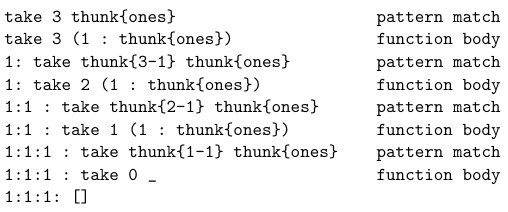

# Week 1 - Translation

## Translation
Translation is the process of converting human-written high-level code into
machine language. There are generally 2 methods of doing this.

 <br />
As can be seen, the compilation process converts source code into machine code,
then feeds in input directly into the target code. Interpretation skips the 
compilation step, and instead converts source code into machine code on the fly.

### Compilation
#### Advantages
- Able to execute the compiled code many times.
- No overhead of translation, so it's generally faster.
#### Disadvantages
- Hard to get useful feedback when debugging, because we are executing the compiled
code.

### Interpretation
#### Advantages
- Portability
- Able to provide useful feedback when debugging.
#### Disadvantages
- Typically slower execution due to having to re-translate every instruction.

> Many modern languages are interpreted, because nowadays, the processing speed
is fast anyways, and better debugging is almost always valued more than speed.

### Pseudo-compilation
 <br />
In Java, a compiler translates the program into bytecode (intermediate code) before
interpreting the intermediate code line-by-line.

### Just-In-Time Compilation
- Compiles on a "as needed" basis.
- Run-time monitoring (adjusts compilation based on frequency)

### The Process of Translation
1. *Lexical analysis* converts source code into sequence of tokens. This is done
through matching via. **regular expressions** .
2. *Syntactic analysis* structures tokens into the initial parse tree. This is done
through **context free grammar** 
3. *Semantic analysis* annotates parse tree with semantic actions.
4. Finally, machine code is produced.

---

# Week 2 - Formal Language Theory
In the English language, we often encounter ambiguities. For example, does 
"drink the water on the desk" mean "drink the water that's **on the desk**" or
"drink the water while **being on the desk**"?

### Lexical Rules (Regular Expressions)
Lexical rules specify **what is a token?** 
This is done through **regular expressions** 

#### Examples
- (a + b)* means all strings containing only a's and b's
- (ab)* means all the repetitions of "ab"

### Syntactic Rules (Context Free Grammar)
Syntactic rules specify how to put the tokens together.
This is done through **context free grammar** 
> Context free grammar has 4 parts, **set of terminals** (atomic symbols),
**set of non-terminals** (variables), **starting non-terminal** , and 
most importantly, **production rules** 

#### Regular Grammars
**Left recursive grammars** are CFGs with at most one variable and it appears as the
**left-most** symbol in the RHS of the production rule. <br />
```
<S> ::= <T> a b
<T> ::= a | <T> b
```

**Right recursive grammars** are CFGs with at most one variable and it appears as the
**right-most** symbol in the RHS of the production rule. <br />
```
<S> ::= a b <T>
<T> ::= a | b <T>
```
#### Derivations
A derivation is simply a series of production rules used to go from the 
**starting non-terminal** to some string `s` that's in the grammar.

#### Parse Trees
A parse tree is a tree where
- the root node is the **start symbol** 
- every leaf is a **terminal symbol** 
- every internal node is a **non-terminal** s.t. its children corresponds
to a production rule for this non-terminal.

#### Examples
Here is an example of real numbers specified in CFG.
 <br />

Here is a derivation for the real number 3.14
```
<r-n> -> <p> . <p> -> <d> . <p> -> <d> . <d> <p> -> 3 . <d> <p> ->
3 . <d> <d> -> 3 . 1 <d> -> 3 . 1 4
```
Note that at each step of the derivation, we only apply one production rule.
> A string is in the language generated by a grammar &harr; there is a derivation 
for it.

Here is a parse tree for 97.123.

 <br />

### Syntactic ambiguities
- A grammar is **ambiguous** &harr; it generates a string for which there are
**two or more distinct** parse trees.
- That string is also called an **ambiguous string** 
> Note that having 2 distinct derivations does not mean ambiguous.

### Correcting for ambiguities
Oftentimes, we may be able to correct ambiguities by imposing **precedence** 
and **associativity** in our CFG. <br /> <br />
For example, consider this ambiguous definition of arithmetics.

 <br />
It's not hard to see that we can parse `8 - 3 * 2`  in exactly 2 ways.

 <br />

#### Precedence
We can change the CFG to impose precedence.
 <br />
Note that now, to get to multiplication, we must first go through subtraction,
otherwise we have to bracket it. So there is no way to parse `8 - 3 * 2` with
multiplication first.

#### Associativity
We can again change the grammar to impose associativity.
 <br />
Note that now the operators must associate to either the right side or the 
left side.

# Week 3 - Racket Programming
### Racket Introduction
Racket is (a)
- imperative programming language (with functional core)
- static scoped
- dynamic typed
- pass-by-value

#### Expressions
```
<expr> ::= <val> | ( <func> <expr> ... )
```
#### Datatypes

##### number: `5, -7, 3.14, ...` 
 <br />
##### symbol: `'a, 'ABC, 'foo-bar, ...` 

##### boolean: `#t, #f` or `true, false` 
 <br />
##### pair: `'(1 . 2), '(1.12 . -4), '(1 . a), ...` 
 <br />
##### list (chained pairs): `'(), '(a b), '(1 2 foo 3.14), ...` 
 <br />

### Read-Eval-Print Loop
* **Read** input from user.
* **Evaluate** input.
  - Lists are evaluated as: `(f arg0 arg1 arg2 ... argn)` 
  1. Evaluate `f` (procedure) and each `arg` from left to right.
  2. Apply procedure to `arg` values.
* Print resulting value (result of procedure application).

##### Example
`(cons 'a (cons 'b '(c d))) => '(a b c d)`

 <br />

#### Evaluation by Substitution
An expression is reduced to a value by repeated finding the **leftmost** expression 
ready for substitution and replacing it with its value.

##### Example 
`(f . (arg0 ... argN))` has value `f(arg0, ..., argN)` but `(1 2 3)` cannot be 
reduced further.

### Special Forms
```
<expr> ::= (and { <expr> })  ; conjunction
<expr> ::= (or { <expr> })   ; disjunction

<expr> ::= (if <expr> <expr> <expr>)  ; (if condition expr0 expr1)
<expr> ::= (cond {(<expr> <expr>)} [(else <expr>)])
; (cond [(cond0 expr0) (cond1 expr1) ... (else exprN)]) 

<defn> ::= (define <id> <expr>)  ; bindings
; Defining a function
(define (fcn_name arg1 arg2 ... argN) (body))

<lambda> ::= (lambda (<arg> ...) <expr> ...)  ; lambda functions
```
### HOP (Higher-order procedures)
#### Map
Map is a ubiquitous function that is available in most modern languages
like Python, Java, and C++. <br /> 
In Racket, it is defined as 
```
(map proc lst1 lst2 ... lstN)
```
where `proc` is applied **element-wise** to elements of 
 `lst1 ... lstN`, returning the list of results `e1 e2 ... eN` 

##### Examples
```
(map abs '(-1 2 -3 4 5)) ==> '(1 2 3 4 5)
(map max '(1 2 3) '(0 5 42)) ==> '(1 5 42)
(map + '(1 2 3) '(2 3 4) '(3 4 5)) ==> '(6 9 12)
(map cons '(a b c) '((a a) (b b) (c c))) ==> '((a a a) (b b b) (c c c))
(map (lambda (x) (+ x 1)) '(1 2 3)) ==> '(2 3 4)
(map (lambda (x y) (+ 1 (- y x))) '(0 5 10) '(1 5 11)) ==> '(2 1 2)
```
#### Fold
Fold may be strange at first sight, but it's a really useful way of applying 
operations recursively onto every elements of a list. There are two variations 
of fold, `foldr` and `foldl`.
```
; right associativity
(foldr binary-op id xs) -> (binary-op x1 (binary-op x2 (binary-op ... (binary-op xN id)...))

; left associativity
(foldl binary-op id xs) -> (binary-op xN (binary-op x(N-1) (binary-op ... (binary-op x1 id)...))
```
##### Example
```
(foldr + 0 '(1 2 3 4))
-> ( + 1 ( + 2 ( + 3 ( + 4 0 ))))
```
#### Apply
Apply "applies" an **n-ary procedure** to all the elements of a list.
```
; condition: proc must be a N-ary procedure
(apply proc xs) -> (proc x1 x2 ... xN)
```
##### Example
```
(apply + '(1 2 3 4)) -> (+ 1 2 3 4) ; notice the difference between this and fold
```
### Parameter lists
Parameter lists is a cool feature in Racket that allows you to define a function 
that takes in a **variable number of parameters**.

Define a parameter list as follows
```
(define list-args (lambda varparam varparam))  ;note that varparam does not have () around it

(list-args) ==> '()
(list-args 'a) ==> '(a)
(list-args 'a 'b 'c 'd) ==> '(a b c d)
```
As you can see, `varparam` essentially "packs" the parameters of the 
`list-args` function and puts it into a list.

With the addition of some pattern matching, we can specify the 
**number of required parameters**.
```
(define sum-non1-args (lambda (fst . varparam) (apply + varparam)))

(sum-non1-args 1) ==> 0
(sum-non1-args 1 2) ==> 2
(sum-non1-args 1 2 3) ==> 5
(sum-non1-args ) ==> Error: requires at least 1 argument

(define sum-non12-args (lambda (fst sec . varparam) (apply + varparam)))

(sum-non12-args 1 2) ==> 0
(sum-non12-args 1 2 3 4) ==> 7
(sum-non12-args 1) ==> Error: requires at least 2 arguments
```
### Scope and Evaluation
We can also use `let` statements to define local variables and the `body` for which 
these variables would apply.
```
(let ([var1 expr1] ... [varn exprn]) body)
```
But be careful, `expr1 ... exprN` are not necessarily evaluated **in order**.

Perhaps we want to use `expr1` inside of `expr2`, we would need to define let with a 
star.
```
(let* ([var1 expr1] ... [varn exprn]) body)
```
But perhaps we want to use `expr2` in `expr1`? Then we would need all the expressions 
essentially evaluated at the same time. We can give off this appearance using 
`letrec` 
```
(letrec ([var1 expr1] ... [varn exprn]) body)
```

### Recursion
Recursion is a core concept in computer programming wherein a function calls 
itself. There are many kinds of recursions, including 
- **Linear recursion**: At most one recursive call made in any execution of function 
body
- **Flat recursion**: recursion is applied over the 'top' items of a list.
- **Deep recursion**: recursion applies over all items (like a tree)
- **Structural recursion**: recursion only within some conditional branch of the 
program.
- **Mutual recursion**:  functions mutually call each other, instead of one function 
calling itself.

One problem with recursion is that it takes too much space. So our goal is to 
perform **linear recursion** as much as possible. But how do we do this?

#### Tail Recursion
Some languages convert any recursive program to linear recursion via a process 
called **tail-call optimization**. We will see some examples of tail-recursive 
programs to better understand what it is.

Consider the simple function of finding the length of a list.
```
; (my-length xs) -> integer?
; xs: list?
; returns the number of elements in xs
(define (my-length xs)  ; return length[xs]
  (if (empty? xs)
      0
      (+ 1 (my-length (rest xs)))))
```

While this program is correct, it needs to make O(n) calls to itself before making 
its first return. That hogs a lot of memory! Especially when n starts to become large.

How about this?
```
; (length-tail xs) -> integer?
; xs: list?
; returns the number of elements in xs
; a tail-recursive version
(define (length-tail xs)  ; return length[xs]
  (local
    [(define (len-t xs len)  ; return length[xs] + len
       (if (empty? xs)
           len
           (len-t (rest xs) (+ 1 len))))]
    (len-t xs 0)))
```

This program is **extensionally equal** to the previous one, but with one major 
difference. 
> Two functions $f$  and $g$  are considered extensionally equal if they agree on their outputs for all inputs

"***The last function call in the function must be the recursive call***."

This guarantees that whenever the function makes a recursive call, it returns 
at the same time, passing whatever it needs to pass to the recursive call. This is 
why tail recursive functions often use an **accumulator**, so that it can store 
whatever information leftover by the function that just returned. A good way to 
think about this is that whatever information the function is supposed to return, is 
stored into the accumulator variable and passed-on to the recursive call.

#### Continuation-Passing Style (CPS)
CPS is a style of tail-recursion that repeatedly passes in **continuations** to the 
recursive call. This style can be difficult to interpret, but in the end, it is just 
a whole lot of substitution.

Consider the expression 
```
(- 4 (+ 1 1))
```
- `(+ 1 1)` in this case, is a **redex**, a reducible expression
- `(- 4 [])` in this case, is the corresponding **continuation**.

So, our continuation needs some result, `v`, that we can substitute in place of 
`[]`, to get our final answer.
```
(lambda (v) (- 4 v))  ;is our continuation
((lambda (v) (- 4 v)) (+ 1 1))  ;is our answer

; but what if we "unsubstitute" one step further?
(lambda (v1) ((lambda (v) (- 4 v)) (+ 1 v1)))
((lambda (v1) ((lambda (v) (- 4 v)) (+ 1 v1))) 1) ;our redex is irreducible
```

Lets examine the difference between tail-recursion style and CPS style.
```
; Here is a tail recursive length
(define (length-tail xs)  ; return length[xs]
  (letrec ([len-t (λ (xs acc)
                 (if (empty? xs)
                     acc
                     (len-t (cdr xs) (+ acc 1))))])
    (len-t xs 0)))

; Lets trace something simple.
(len-t '(1 2) 0)
(len-t '(2) (+ 0 1))
(len-t '() (+ (+ 0 1) 1))
(+ (+ 0 1) 1)
(+ 1 1)
2

; Here is a CPS definition
(define (my-length-cps xs)   ; return length[xs]
  (letrec ([len-cps (λ (xs k)
                      (if (empty? xs)
                          (k 0)
                          (len-cps (rest xs)
                                   (λ (v) (k (+ 1 v))))))])
    (len-cps xs (λ (x) x))))

; The same trace.
(len-cps '(1 2) (λ (x) x))
(len-cps '(2) (λ (v) (+ 1 v)))
(len-cps '() (λ (v1) ((λ (v) (+ 1 v)) (+ 1 v1)))))
((λ (v1) ((λ (v) (+ 1 v)) (+ 1 v1))) 0)
(λ (0) ((λ (v) (+ 1 v)) (+ 1 v1)))
((λ (v) (+ 1 v)) (+ 1 0))
((λ (v) (+ 1 v)) 1)
(λ (1) (+ 1 v))
(+ 1 1)
2
```
Where tail recursion collects evaluation steps in its accumulator and evaluates,
CPS does something more subtle here.

It does look much more complicated, but take a look at when `len-cps` finally 
disappears. We are left with something very interesting. It's a function we can 
apply to the base case, which is `0` in this case, to obtain the final result,
through repeated substitution, which by the way, is basically **beta-reduction** 
in L-calculus. Now we're pretty deep in math...

So in summary, CPS is just a way to fully express, what needs to be done to fully 
evaluate some expression.

### Closure
A closure is a record that contains:
- a function, and
- an environment

Consider
```
(define (make-inc x)
  (lambda (y) (+ x y)))
```
`make-inc` is a function that takes in some `x`, that returns another function, 
which takes some `y`, and returns `x + y`.

In `(lambda (y) (+ x y)))`, `x` is a **free variable**, and when a closure is 
created, the environment of that closure will immediately capture the bindings for all 
free variables.

Let's explain with an example.
```
(define x 100)
(define (plus-x y)
  (+ x y))

; Here, we've first defined x, then upon defining plus-x, the free variable x 
; immediately gets bound to 100. Now, we have a closure that contains the function 
; plus-x, with x bound to 100.

; What happens if we try to redefine x?
(let ([x 200])
  (plus-x 10))

; Is (plus-x 10) going to return 110 or 210?

; Well, the answer is 110, because the closure around bounded x to 100

; However, we can forcefully rebind x by using 
(!set x 200)
```

# Haskell and Functional Programming
### Introduction
In imperative languages
- **Programs** are instructions written in machine-code
- **Execution** of programs are the execution of the instruction on the CPU

In functional languages
- **Programs** are viewed as collections of **functions**.
- **Execution** of programs is viewed as **evaluation**.

Functional languages exhibit **referential transparency**, which means that 
the value of a function application is independent of the context in which it occurs.
In other words, value of `f(a,b,c)` depends only on the values of f, a, b, and c.
This facilitates reasoning about programs and applying program transformations.

Variables in functional languages cannot be redeclared and function calls have no 
side effects, which means they can be reasoned about in isolation.

Functions are also **first-class values**, which means they may be returned as the 
value of an expression, and can be passed as an argument. Unnamed functions are 
considered as values.

In a functional language, we should **not** be thinking about memory management.

### Type Systems
Type systems allow for a programming language to employ safety measures to prevent 
unsafe operations, like calling the `length` function on a number, or calling 
the `is_even` function on a list.

A **type** is a name for a set of values and some operations which can be performed 
on that set of values.

Examples of types include (in Haskell notation)
- `Int` : Integers
- `Integer` : unbounded integers
- `Float, Double` 
- `Char` 
- `Bool` 
- `Int -> Bool` : functions that take integers as input and return booleans as output
What constitutes a type is language dependent.

Benefits of typing include 
- Easier to debug programs 
- **Static analysis**, which generates useful information about the program at 
compile-time
- Efficiency, because typing can be used by the compiler to generate quicker code.
- Correctness, because typing can be used to prove the correctness of code
- Documentation, because types allow the programmer to express intent.

A program is **type-safe** if no program is allowed to violate its type distinctions.

The process of verifying and enforcing the constraints of types is called 
**type checking**, which can occur either at compile-time (**static type checking**)
or at run-time (**dynamic type checking**)

Dynamic type checking 
- Is performed at run-time 
- Slower Execution
- More flexible to program

Static type checking 
- Faster execution 
- Compiler able to do optimization 
- May result in safer and more elegant programs.

Static type checking can also be categorized as 
- **Explicit**  static typing - code contains type annotations (like Java)
- **Type Inference** - types inferred from code that does not have explicit 
type annotations

### Haskell Types
Some basic types in Haskell include:
- `()`  - the only member is () itself.
- `Bool`  - booleans
- `Int` , Integer - integers
- `Float`  Double - reals
- `Char`  - characters

Some more types include 
- `(<type0>,<type1>,...,<typeN>)`  - tuples
- `[<type>]`  - lists
- `<input-type> -> <output-type>`  - functions.

#### Haskell Lists
Haskell lists can only have **one** type, and supports plenty of operations 
including HOP like `map` and `fold`.

#### Haskell Variable Declaration
Variables in Haskell can be declared as follows:
```
<name> = <expr>
x = 42 + 24
```

#### Haskell Functions
Anonymous functions in Haskell can be declared via 
```
\<arg> -> <body>
```
Named functions can be declared via 
```
<name> <arg> = <body>
```

The type of a Haskell function can be inferred by its powerful compiler through 
looking at its inputs and outputs.

> Haskell functions technically only takes in one argument. Taking multiple arguments 
is done through **currying**, which we will talk about later.

#### Parametric polymorphism
A function in Haskell may use **alpha types**, which can stand for any instantiated
types.
```haskell
-- What is the type of \x -> x?
(\x -> x) :: t -> t
```
Where `t` is any type. But note that the input type must be equal to the output type.
This means we can map an integer to an integer or a char to a char,
but not an integer to a char. 

`\x -> x` is said to be a **polymorphic** function.
```
α → α means “for every valid type α, α → α” 
∀α · α → α
```
Here are some examples of parametric polymorphism
```haskell
choose (a,b,c) = if a then b else c
choose :: (Bool, t, t) -> t

swap (x,y) = (y,x)
swap :: (t1, t) -> (t, t1)
```

### Pattern Matching
Pattern matching is a powerful concept in Haskell that allows users to specify 
functions in terms of matching arguments of the functions to specific patterns.
```
<name> <pattern1> = <exp1>
<name> <pattern2> = <exp2>
.
.
.
<name> <patternN> = <expN>
```
The function `name` takes **one** argument (like any other Haskell function) and 
tries to match the argument to `pattern1`. If it succeeds, it returns the value of 
`expr1`. Otherwise, it tries to match the argument to `pattern2` , and so on...

Special notes:
```haskell
x : xs = [1,2,3] -- list matching
x -- 1 
xs -- [2,3]

(_,x,y) = (1,2,3) -- _ operator matches with anything, and binds nothing
```

### Extra Haskell notes
Let and Where statements:
```haskell
-- We can write 
reverse [] = []
reverse (x : xs) = reverse xs ++ [x]
-- using let, as 
reverse xs =
  let 
    rev ([], rs) = rs
    rev (x : xs, rs) = rev (xs, x : rs)
  in rev (xs, [])
-- for a tail-recursive style
-- or equivalently, using where, as
reverse xs = rev (xs, []) where 
  rev ([], rs) = rs
  rev (x : xs, rs) = rev (xs, x : rs)
```
Guards: 
```haskell
-- we can write
abs x = if x >= 0 then x else -x
-- with guards as
abs x | x >= 0 = x 
      | otherwise = -x
```

### Haskell Type Classes
What is the type of `42`?
```
42 :: Num a => a
```
- `Num` is a **type class**
- `Num a` is a **type constraint** 
- `Num a => a` means some type `a` in the class `Num`, where all types in the class 
`Num` must implement addition, subtraction, multiplication, ...

In this sense, types are sort of like classes in Java and type classes are sort of like interfaces in Java.

**Type classes** offer a controlled approach to overloading.

Some common predefined classes include `Eq`, `Ord`, `Show`, `Read`, `Num`, ...

You can create instances of these classes or even create your own type classes and 
instantiate them.

### Currying
**Currying** is the process of transforming a function that takes in a tuple as its 
argument, into a function that takes in a single argument and returns another function 
that accepts further arguments, one by one, that the original function would receive 
in the rest of that tuple.
```
(a,b) -> c is transformed into a -> b -> c
```

Note that `->` is right associative, which makes function application 
left-associative
```
a -> b -> c equivalent to a -> (b -> c)
f x y equivalent to (f x) y
```

Currying with named functions
```
sum :: Num a => (a, a) -> a
sum (x,y) = x + y
sum :: Num a => a -> a -> a
sum x y = x + y
```

With currying, we can perform partial applications.
```haskell
sum :: Num a => a -> a -> a
sum x y = x + y

sum 2 3 -- 5

sum 2 -- Num a => a -> a

add2 = sum 2
add2 :: Num a => a -> a

add2 3 -- 5

sum = (\x -> \y -> x + y)
sum :: Num a => a -> a -> a

sum42 = (\x -> \y -> x + y) 42
sum :: Num a => a -> a
```
Any two-parameter curried function can be used as an operator
```haskell
elem 3 [2,3,4] -- True
3 `elem` [2,3,4] -- True
```
Any operator can be used as a function
```
(+) 2 3 -- 5
(*) 2 3 -- 6
```
Some more interesting applications of curried functions
```haskell
map (+2) [1,2,3] -- [3,4,5]
prompt> map (2+) [1,2,3] -- [3,4,5]
prompt> map (/2) [1,2,3] -- [0.5,1.0,1.5]
prompt> map (2/) [1,2,3] -- [2.0,1.0,0.6666666666666666]
prompt> map (:[42]) [1,2,3] -- [[1,42],[2,42],[3,42]]
prompt> map (42:) [[1],[2,3],[4,5]] -- [[42,1],[42,2,3],[42,4,5]]
```

### User Defined Datatypes
#### Type Synonyms
We are able to give **alias** to existing types. This provides useful abstractions.
```haskell
-- declared as
type NewType = OldType

-- Useful examples
type String = [Char]
type PhoneNumber = String 
type Name = String
type PhoneBook = [(Name, PhoneNumber)]
```

#### User Defined Datatypes
```haskell
data NewType =
    Cons1 Type1
  | Cons2 Type2
     ...
  | ConsN TypeN
```
Defines a new type `NewType`, where `Type1, ..., TypeN` are previously defined 
types, and `Cons1, ..., ConsN` are **constructors** used to create a value of 
`NewType` type.

In the case of constant constructors, we do not need arguments to constructors.
For example, we can define an enumerated type:
```haskell
data Colour = Red | Green | Blue
-- We can then define a function on this type (pattern matching style)
colorName Red = "red"
colorName Green = "green"
colorName Blue = "blue"

colorName :: Colour -> [Char]
```
We can of course create a union of different types 
```haskell
data Text = Letter Char | Word [Char]
-- Note that functions we define that operate on this type must include 
-- patterns for both constructors
textLen (Letter _) = 1
textLen (Word w) = length w

textLen :: Text -> Int
```
Let's take a look at recursive types
```haskell
-- Here is our own definition of a linked list
data LList = Nil | Node (Int, LList) deriving Show

llist = Node (1, Node (2, Node(3, Nil)))

llistLen Nil = 0
llistLen (Node (_,rest)) = 1 + llistLen rest

llistLen :: LList -> Int

-- What if we want to have "anything" in our linked list? 
-- We should define a polymorphic linked list
data LList a = Nil | Node (a, LList a) deriving Show

llist1 = Node (1, Node (2, Node(3, Nil)))
llist2 = Node ('1', Node ('2', Node ('3', Nil)))

llistLen Nil = 0
llistLen (Node (_,rest)) = 1 + llistLen rest

llistlen :: LList t -> Int
```

##### Recursive type for mathematical expressions
Let's define a recursive type for simple arithmetic
 <br />
```haskell
-- curried
data MathExpr = Leaf Int | Unary (Int -> Int) MathExpr 
                         | Binary (Int -> Int -> Int) MathExpr MathExpr
-- uncurried
data MathExpr = Leaf Int | Unary (Int -> Int, MathExpr)
                         | Binary (Int -> Int -> Int, MathExpr, MathExpr)
```
Where our uncurried tree looks like,

 <br />
As you will see, the curried version will look a lot better
```haskell
t = Binary (+) 
      (Binary (+) 
         (Unary abs 
           (Unary (0-) 
             (Leaf 3))) 
         (Leaf 2)) 
      ...
```
An evaluator for this tree will look like
```haskell
eval (Leaf v) = v
eval (Unary (f,t)) = f (eval t)
eval (Binary (f,l,r)) = f (eval l) (eval r)

eval :: MathExpr -> Int
```

##### Defining a binary tree in Haskell
Now let's define a binary tree, but using curried constructors
```haskell
-- Empty constructor is simply a constant (represented by the constructor,
-- remember how functions can be values?)
--
-- The constructor Node takes in some alpha type, along with two more BTrees of 
-- alpha type, and returns a BTree of alpha type.
data BTree a = Empty | Node (a, BTree a, BTree a) -- uncurried
data BTree a = Empty | Node a (BTree a) (BTree a) -- curried

-- With curried constructors, we can write much more elegant code
t = (Node 1 (Node 2 (Node 3 Empty Empty)
                    (Node 4 Empty Empty))
            (Node 5 (Node 6 Empty Empty)
                    (Node 7 Empty
                            (Node 8 Empty Empty))))
-- t :: BTree Integer, functions are values are the same

-- Note that with curried definition, we can also do partial applications
prompt> :t Node "a"
Node "a" :: BTree [Char] -> BTree [Char] -> BTree [Char]
prompt> :t Node "a" Empty
Node "a" Empty :: BTree [Char] -> BTree [Char]
prompt> :t Node "a" Empty (Node "a" Empty Empty)
Node "a" Empty (Node "a" Empty Empty) :: BTree [Char]
```

##### Mutually recursive types
What if we want a tree with labelled branches instead of labelled nodes like we're 
used to?
```haskell
data Tree a = Empty | Node (Branch a) (Branch a)
data Branch a = Branch a (Tree a) -- Note that the TypeName has the same name as Constructor?
```
Our tree would look something like 

 <br />
defined as 
```haskell
lt =
  Node(Branch 1
          (Node (Branch 2 Empty) 
                (Branch 3 (Node (Branch 4 Empty)
                                (Branch 5 Empty)))))
      (Branch 6
          (Node (Branch 7 Empty)
                (Branch 8 Empty)))

-- Given the recursive definition of the data type, we would also expect 
-- functions for this data type to be recursive
listTree Empty = []
listTree (Node l r) = (listBranch l) ++ (listBranch r)

listBranch (Branch b t) = b : listTree t

listTree :: Tree a -> [a]
listBranch :: Branch a -> [a]
```

##### Infix value constructors
We can also define infix data types, like rational numbers
```haskell
-- Rational data type defines some x/y
data Rational = Integer :/ Integer deriving Show

-- We can apply the constructor ":/" as follows
r1 = 1 :/ 2
r2 = 1 :/ 3

-- Here is a function that adds two rationals together, unfactored
addRat (x0 :/ y0) (x1 :/ y1) =
(x0 * y1 + x1 * y0) :/ (y0 * y1)

-- This means our list constructor is also an infix constructor
(:) :: a -> [a] -> [a]
```

### Type Class - Eq
The `Eq` type class is all types with **equality** defined.

 > Remember how type classes are like Java interfaces? This means that any instantiations 
of a type class must implement the methods specified by that type class.

For the type class `Eq`, all types in this class must provide definitions for 
`== and /=`.

Let's take a look at an example
```haskell
-- The member function tells us whether some element is a member of a list
member _ [] = False
member y (x : xs) = x == y || member y xs

-- Note that we must be able to test for equality to determine membership.
member :: (Eq t) => t -> [t] -> Bool
```
`(Eq t)` is a **type class constraint**, which specifies that any alpha type 
`t` must be member of `Eq`.

All base types are members of `Eq`.

#### "deriving" Keyword
When we specify that a type "derives" some type class, we are simply telling 
Haskell to **automatically** define equality on the type. Sometimes this is good, 
but sometimes it isn't sufficient, and we must provide **non-derived** methods 
for that data type.

### Non-derived type class methods
For example, lets define a datatype `First`, that basically only cares about the 
first element in a tuple.
```haskell
data First = Pair Int Int

-- Note that we cannot just "derive" Eq, as it most likely will not have the 
-- specific behavior that we want. Thus, we must "make First an instance of Eq".
instance Eq First where 
  (Pair x _) == (Pair y _) = (x == y)
```
The first thing to notice here is that `==` is an infix operator taking 2 
parameters. That's why it's in the middle.

The next thing, perhaps more subtle, is that we are able to compare `x` and `y`.
This is because `x` and `y` are of type `Int`, which by default is a member of `Eq`.
If we don't use `Int`, and instead make a more general `First` data type, then we 
will have to **manually** make sure that `x` and `y` are indeed of a type that is 
a member of `Eq`.
```haskell
data First a = Pair a a

instance Eq a => Eq (First a) where 
  (Pair x _) == (Pair y _) = (x == y)
```
Notice the type constraint `Eq a`.

### Defining our own Type Classes
Let's go one step further and define our own type classes. Note that type classes 
are simply interfaces, and thus we need to define which methods members must define.
```haskell
class Eq a where  -- "a" represents the member type
  (==), (/=) :: a -> a -> Bool -- members must implement both == and /=
  x /= y = not (x == y) -- default definition for /=
  x == y = not (x /= y) -- default definition for ==
```
Notice how we provided default definitions for both functions in terms of each 
other? The beauty of this is that we only have to define one of `==` or `/=`, and 
our default definitions will take care of the rest. This is very convenient.

### Other base Type Classes
#### Ord
`Ord` inherits from `Eq` and specifies the four comparison operators, 
`<`, `>`, `<=`, and `>=`, and gives default definitions for `min` and `max` in 
terms of these operators. There is also a `compare` function that returns 
`LT`, `GT` and `EQ`.

Most basic datatypes are instances of `Ord`, and user-defined data types can 
derive `Ord` (Lexicographic Ordering).

#### Show
`Show` allows types to be displayed in `stdout`. Members must implement the 
`show` method.

#### Num
`Num` inherits from `Eq` and specifies standard arithmetic operators.

### Defining a YesNo Class
Languages like python offers a convenient way of using usual data types like 
`True` and `False`. For example, the number `0` is usually interpreted as `False`,
and any other number is interpreted as `True`.

We can define this behavior in Haskell by defining a type class `YesNo` 
```haskell
class YesNo a where 
  yesno :: a -> Bool

-- Let define some instances
instance YesNo Integer where 
  yesno 0 = False
  yesno _ = True

instance YesNo [a] where 
  yesno [] = False
  yesno _ = True

-- and so on...
```

### List Comprehensions
Haskell has a very nice way to define all kinds of sets in math notation.

Lets take a look at some HOP defined in terms of list comprehensions.
```haskell
map :: (a -> b) -> [a] -> [b]
map f xs = [f x | x <- xs]
-- map is simply a list where every element in mapped to some y by f

filter :: (a -> Bool) -> [a] -> [a]
filter f xs = [x | x <- xs, f x]
-- filter is simply a list where we only keep elements that returns True for f

cross :: [a] -> [b] -> [(a,b)]
cross xs ys = [(x,y) | x <- xs, y <- ys]
-- This is Euclidian Cross
```

Lets take a look at **Ranges** 
```haskell
[1..10] -- [1,2,3,4,5,6,7,8,9,10]
[1,3..10] -- [1,3,5,7,9]
[10,9..1] -- [10,9,8,7,6,5,4,3,2,1]
[10,8..1] -- [10,8,6,4,2]
```
Haskell has powerful lists...

### Lazy Evaluation
Haskell employs **Lazy Evaluation**. In other words, don't evaluate before you have to.
```haskell
and' :: Bool -> Bool -> Bool
and' False _ = False
and' _ x = x

head [] -- Exception
and' False (head [] == 2) -- False
-- How is this possible? Ex. Why no error? Ans: Lazy evaluation
```
- Expressions are not evaluated when they are bound to variables, but their 
evaluation is **deferred** until their results are needed by other computations.

- Arguments are not evaluated before they are passed to a function, but only when 
their values are actually used.

- A **Thunk** is an unevaluated value with a recipe that explains how to evaluate it.

This is very useful, for example,
```haskell
length [] = 0
length (_:xs) = 1 + length xs

-- Imagine evaluating
length [42^1234, 42^3333, 42^9999]

-- What would happen if we were to first evaluate each number?

-- It will take eons...
```
But with lazy evaluation, Haskell evaluates that expression perfectly fine!
 <br />

#### Generators
Lazy evaluation allow us to define **generators**, which are supposedly 
infinite recursion, but are instead perfectly acceptable, if we restrict it 
to a finite domain.
```haskell
-- Consider a generator for 1's
ones = 1 : ones  -- if we call ones directly, then we will get an infinite recursion.

-- However, we can use the "take" method to take a finite amount of 1's
tenOnes = take 10 ones

-- take is defined as 
take _ [] = []
take 0 _ = []
take n (x:xs) = x : take (n-1) xs
```
This means we have 

 <br />
And we will never encounter an infinite loop!


# Extra - Famous Scientists

### Donald Knuth
Donald Knuth is a Computer Scientist and Mathematician whose been called the
"Father of analysis of algorithms". Knuth worked on a famous series of textbooks
named "The Art of Computer Programming". Knuth is also responsible for popularizing
the Big Oh notation.

